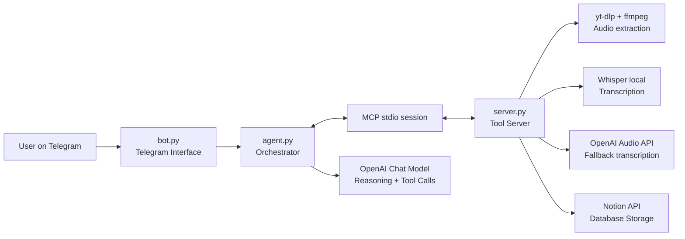
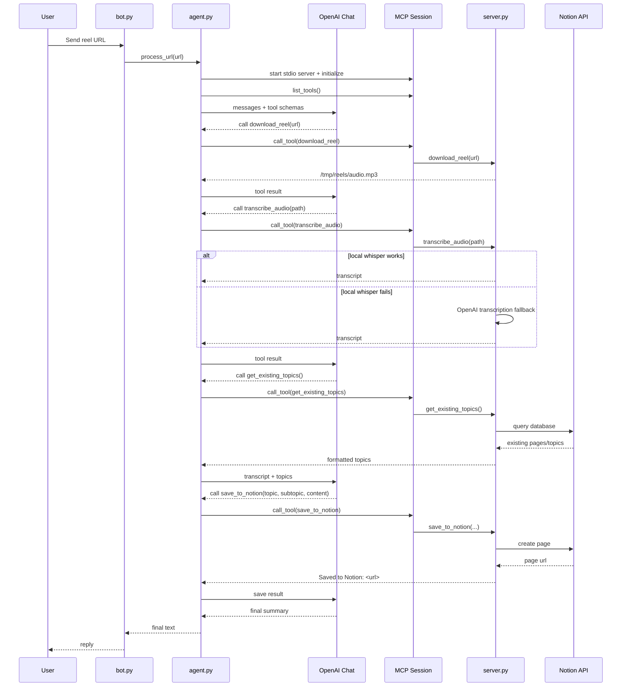
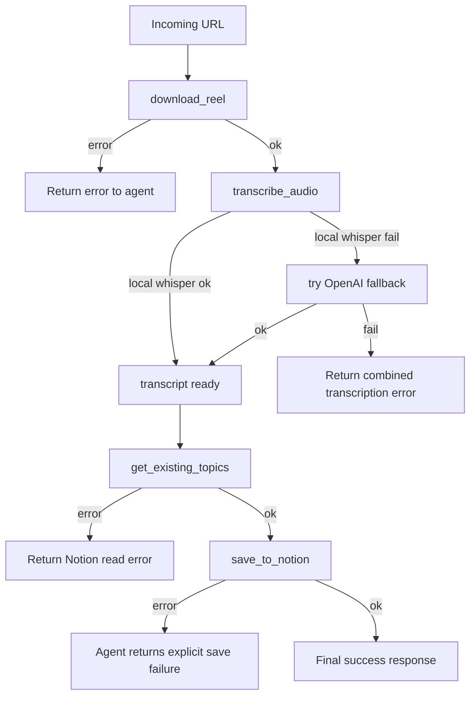

# Architecture & Flow Diagrams — Reel Knowledge Agent

This file contains ready-to-teach diagrams using Mermaid.

---

## 1) High-level architecture



---

## 2) End-to-end sequence (single reel)



---

## 3) Agentic loop state flow

```mermaid
flowchart TD
    S0[Start process_url] --> S1[Build system + user messages]
    S1 --> S2[Call OpenAI chat completion]
    S2 --> Q{tool_calls present?}
    Q -- Yes --> T1[Execute each tool via MCP]
    T1 --> T2[Append tool outputs to messages]
    T2 --> S2
    Q -- No --> G{save_to_notion attempted?}
    G -- No --> R1[Inject reminder message\n"must call save_to_notion"]
    R1 --> S2
    G -- Yes --> G2{last save result starts with Error?}
    G2 -- Yes --> E[Return explicit Notion failure]
    G2 -- No --> F[Return final assistant summary]
```

---

## 4) Tool layer architecture

```mermaid
flowchart TB
    subgraph MCP_Server[server.py - FastMCP]
        D[download_reel(url)]
        T[transcribe_audio(file_path)]
        G[get_existing_topics()]
        V[save_to_notion(topic, subtopic, content)]
    end

    D --> D1[yt-dlp subprocess]
    D1 --> D2[/tmp/reels/audio.mp3]

    T --> T1[Whisper base local]
    T --> T2[OpenAI transcription fallback]
    T --> T3[cleanup temp file]

    G --> NQ[POST /databases/{id}/query]
    V --> NP[POST /pages]
```

---

## 5) Failure-handling flow



---

## 6) One-line architecture summary

Telegram UI triggers an OpenAI-driven agent loop that calls MCP tools for media download/transcription/classification context and persists structured knowledge to Notion.
